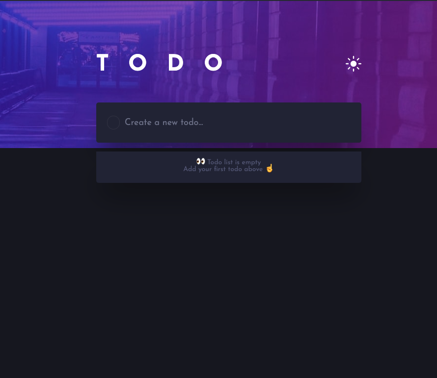
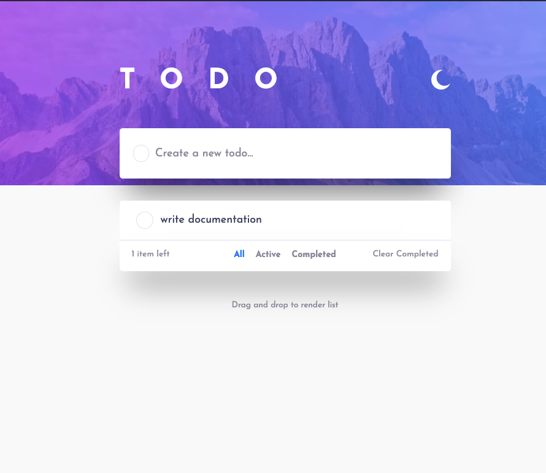
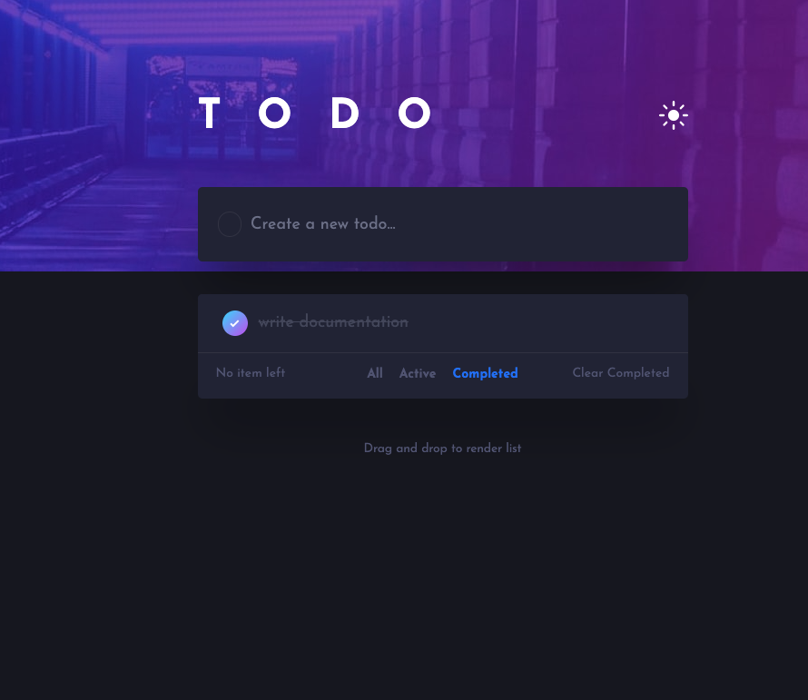

# Frontend Mentor - Todo app solution

This is a solution to the [Todo app challenge on Frontend Mentor](https://www.frontendmentor.io/challenges/todo-app-Su1_KokOW). Frontend Mentor challenges help you improve your coding skills by building realistic projects.

## Table of contents

- [Frontend Mentor - Todo app solution](#frontend-mentor---todo-app-solution)
  - [Table of contents](#table-of-contents)
  - [Overview](#overview)
    - [The challenge](#the-challenge)
    - [Screenshot](#screenshot)
    - [Links](#links)
  - [My process](#my-process)
    - [Built with](#built-with)
    - [What I learned](#what-i-learned)
    - [Useful resources](#useful-resources)
  - [Author](#author)

## Overview

### The challenge

Users should be able to:

- View the optimal layout for the app depending on their device's screen size
- See hover states for all interactive elements on the page
- Add new todos to the list
- Mark todos as complete
- Delete todos from the list
- Filter by all/active/complete todos
- Clear all completed todos
- Toggle light and dark mode
- **Bonus**: Drag and drop to reorder items on the list

### Screenshot

<br>

Empty list

Light theme

Complete todo


### Links

- Solution URL: [Add solution URL here](https://your-solution-url.com)
- Live Site URL: [Add live site URL here](https://your-live-site-url.com)

## My process

### Built with

- [React](https://reactjs.org/) - JS library
- [Redux.js](https://redux.js.org/) - React framework
- [Styled Components](https://styled-components.com/) - For styles

### What I learned

I learned how to create global styles and how to use the theme context to toggle the theme-mode using styled-components. I also improve my redux knowledge.

```js
import styled, { createGlobalStyle } from 'styled-components';

export const GlobalStyles = createGlobalStyle` {
  *,
  *::before,
  *::after {
    margin: 0;
    padding: 0;
    box-sizing: border-box;
  }
}
```

```jsx
const App = ({ children }) => {
  const currentTheme = () => {
    const localTheme = localStorage.getItem('TODO_THEME');
    return localTheme || 'dark';
  };

  const [theme, toggleTheme] = useTheme(currentTheme);
  const themeMode = theme === 'dark' ? darkTheme : lightTheme;

  <ThemeProvider theme={themeMode}>{children}</ThemeProvider>;
};
```

### Useful resources

- [react-beautiful-dnd](https://github.com/atlassian/react-beautiful-dnd) - This helped me for implement the drag and drop functionality and understand how to use it. I'd recommend it to anyone still learning this concept.

## Author

- Website - [faber](https://faberdev.netlify.app/)
- Twitter - [faber](https://twitter.com/faber_dev)
- Frontend Mentor - [faber](https://www.frontendmentor.io/profile/fab-rvn)
